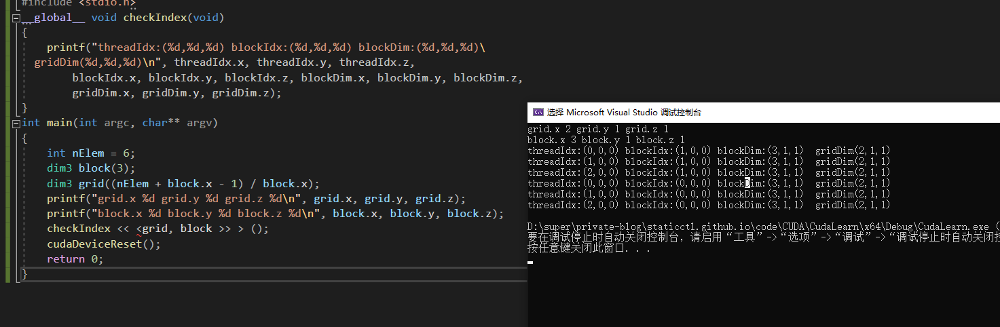

### CUDA编程模型概述1

**Abstract:** 本文介绍CUDA编程模型的简要结构，包括写一个简单的可执行的CUDA程序，一个正确的CUDA核函数，以及相应的调整设置内存，线程来正确的运行程序。
**Keywords:** CUDA编程模型，CUDA编程结构，内存管理，线程管理，CUDA核函数，CUDA错误处理

参考：https://github.com/Tony-Tan

这一章主要是讲解这些工具怎么用，如何编写调试CUDA程序，编写两个矩阵运算有关的CUDA应用

> ### CUDA编程模型概述

CUDA编程模型为应用和硬件设备之间的桥梁，所以CUDA C是编译型语言，不是解释型语言，OpenCL就有点类似于解释型语言，通过编译器和链接，给操作系统执行（操作系统包括GPU在内的系统），下面的结构图片能形象的表现他们之间的关系：


其中Communication Abstraction是编程模型和编译器，库函数之间的分界线。
可能大家还不太明白编程模型是啥，编程模型可以理解为，我们要用到的语法，内存结构，线程结构等这些我们写程序时我们自己控制的部分，这些部分控制了异构计算设备的工作模式，都是属于编程模型。

GPU中大致可以分为：

- 核函数
- 内存管理
- 线程管理
- 流

等几个关键部分。

以上这些理论同时也适用于其他非CPU+GPU异构的组合。
下面我们会说两个我们GPU架构下特有几个功能：

- 通过组织层次结构在GPU上组织线程的方法
- 通过组织层次结构在GPU上组织内存的方法

也就是对内存和线程的控制将伴随我们写完前十几篇。
从宏观上我们可以从以下几个环节完成CUDA应用开发：

1. 领域层
2. 逻辑层
3. 硬件层

第一步就是在领域层（也就是你所要解决问题的条件）分析数据和函数，以便在并行运行环境中能正确，高效地解决问题。

当分析设计完程序就进入了编程阶段，我们关注点应转向如何组织并发进程，这个阶段要从逻辑层面思考。

CUDA模型主要的一个功能就是线程层结构抽象的概念，以允许控制线程行为。这个抽象为并行变成提供了良好的可扩展性（这个扩展性后面有提到，就是一个CUDA程序可以在不同的GPU机器上运行，即使计算能力不同）。
在硬件层上，通过理解线程如何映射到机器上，能充分帮助我们提高性能。

> ### CUDA编程结构

一个异构环境，通常有多个CPU多个GPU，他们都通过PCIe总线相互通信，也是通过PCIe总线分隔开的。所以我们要区分一下两种设备的内存：

- 主机：CPU及其内存
- 设备：GPU及其内存

注意这两个内存从硬件到软件都是隔离的（CUDA6.0 以后支持统一寻址），我们目前先不研究统一寻址，我们现在还是用内存来回拷贝的方法来编写调试程序，以巩固大家对两个内存隔离这个事实的理解。

一个完整的CUDA应用可能的执行顺序如下图：


从host的串行到调用核函数（核函数被调用后控制马上归还主机线程，也就是在第一个并行代码执行时，很有可能第二段host代码已经开始同步执行了）。

我理解的：在核函数调用后计算任务已经交给了GPU，CPU此时闲置下来

我们接下来的研究层次是：

- 内存
- 线程
- 核函数
  - 启动核函数
  - 编写核函数
  - 验证核函数
- 错误处理

> ### 内存管理

内存管理在传统串行程序是非常常见的，寄存器空间，栈空间内的内存由机器自己管理，堆空间由用户控制分配和释放，CUDA程序同样，只是CUDA提供的API可以分配管理设备上的内存，当然也可以用CDUA管理主机上的内存，主机上的传统标准库也能完成主机内存管理。
下面表格有一些主机API和CUDA C的API的对比：

| 标准C函数 | CUDA C函数 |   说明   |
| :-------: | :--------: | :------: |
|  malloc   | cudaMalloc | 内存分配 |
|  memcpy   | cudaMemcpy | 内存复制 |
|  memset   | cudaMemset | 内存设置 |
|   free    |  cudaFree  | 释放内存 |

我们先研究最关键的一步，这一步要走总线的

```c++
cudaError_t cudaMemcpy(void * dst,const void * src,size_t count,
  cudaMemcpyKind kind)
```

这个函数是内存拷贝过程，可以完成以下几种过程（cudaMemcpyKind kind）

- cudaMemcpyHostToHost
- cudaMemcpyHostToDevice
- cudaMemcpyDeviceToHost
- cudaMemcpyDeviceToDevice

这四个过程的方向可以清楚的从字面上看出来，这里就不废话了，如果函数执行成功，则会返回 cudaSuccess 否则返回 cudaErrorMemoryAllocation

使用下面这个指令可以吧上面的错误代码翻译成详细信息：

```c++
char* cudaGetErrorString(cudaError_t error)
```

内存是分层次的，下图可以简单地描述，但是不够准确，后面我们会详细介绍每一个具体的环节：


共享内存（shared Memory）和全局内存（global Memory）后面我们会特别详细深入的研究，这里我们来个例子，两个向量的加法：

代码库：`https://github.com/Tony-Tan/CUDA_Freshman`

```c++
/*
* https://github.com/Tony-Tan/CUDA_Freshman
* 3_sum_arrays
*/
#include <cuda_runtime.h>
#include <stdio.h>
#include "freshman.h"


void sumArrays(float * a,float * b,float * res,const int size)
{
  for(int i=0;i<size;i+=4)
  {
    res[i]=a[i]+b[i];
    res[i+1]=a[i+1]+b[i+1];
    res[i+2]=a[i+2]+b[i+2];
    res[i+3]=a[i+3]+b[i+3];
  }
}
__global__ void sumArraysGPU(float*a,float*b,float*res)
{
  int i=threadIdx.x;
  res[i]=a[i]+b[i];
}
int main(int argc,char **argv)
{
  int dev = 0;
  cudaSetDevice(dev);

  int nElem=32;
  printf("Vector size:%d\n",nElem);
  int nByte=sizeof(float)*nElem;
  float *a_h=(float*)malloc(nByte);
  float *b_h=(float*)malloc(nByte);
  float *res_h=(float*)malloc(nByte);
  float *res_from_gpu_h=(float*)malloc(nByte);
  memset(res_h,0,nByte);
  memset(res_from_gpu_h,0,nByte);

  float *a_d,*b_d,*res_d;
  CHECK(cudaMalloc((float**)&a_d,nByte));
  CHECK(cudaMalloc((float**)&b_d,nByte));
  CHECK(cudaMalloc((float**)&res_d,nByte));

  initialData(a_h,nElem);
  initialData(b_h,nElem);

  CHECK(cudaMemcpy(a_d,a_h,nByte,cudaMemcpyHostToDevice));
  CHECK(cudaMemcpy(b_d,b_h,nByte,cudaMemcpyHostToDevice));

  dim3 block(nElem);
  dim3 grid(nElem/block.x);
  sumArraysGPU<<<grid,block>>>(a_d,b_d,res_d);
  printf("Execution configuration<<<%d,%d>>>\n",block.x,grid.x);

  CHECK(cudaMemcpy(res_from_gpu_h,res_d,nByte,cudaMemcpyDeviceToHost));
  sumArrays(a_h,b_h,res_h,nElem);

  checkResult(res_h,res_from_gpu_h,nElem);
  cudaFree(a_d);
  cudaFree(b_d);
  cudaFree(res_d);

  free(a_h);
  free(b_h);
  free(res_h);
  free(res_from_gpu_h);

  return 0;
}
```

解释下内存管理部分的代码：

```c++
cudaMalloc((float**)&a_d,nByte);
```

分配设备端的内存空间，为了区分设备和主机端内存，我们可以给变量加后缀或者前缀h_表示host，d_表示device

<font color="red">一个经常会发生的错误就是混用设备和主机的内存地址！！</font>

> ### 线程管理

当内核函数开始执行，如何组织GPU的线程就变成了最主要的问题了，我们必须明确，一个核函数只能有一个grid，一个grid可以有很多个块，每个块可以有很多的线程，这种分层的组织结构使得我们的并行过程更加自如灵活：


一个线程块block中的线程可以完成下述协作：

- 同步
- 共享内存

<font color = "red">不同块内线程不能相互影响！他们是物理隔离的！</font>

接下来就是给每个线程一个编号了，我们知道每个线程都执行同样的一段串行代码，那么怎么让这段相同的代码对应不同的数据呢？首先第一步就是让这些线程彼此区分开，才能对应到相应从线程，使得这些线程也能区分自己的数据。如果线程本身没有任何标记，那么没办法确认其行为。
依靠下面两个内置结构体确定线程标号：

- blockIdx（线程块在线程网格内的位置索引）
- threadIdx（线程在线程块内的位置索引）

注意这里的Idx是index的缩写（我之前一直以为是identity x的缩写），这两个内置结构体基于 uint3 定义，包含三个无符号整数的结构，通过三个字段来指定：

- blockIdx.x
- blockIdx.y
- blockIdx.z
- threadIdx.x
- threadIdx.y
- threadIdx.z

上面这两个是坐标，当然我们要有同样对应的两个结构体来保存其范围，也就是blockIdx中三个字段的范围，threadIdx中三个字段的范围：

- blockDim
- gridDim

他们是dim3类型（基于unit3定义的数据结构）的变量，也包含三个字段x,y,z

- blockDim.x
- blockDim.y
- blockDim.z

**!!! 一个kerkel 分配 一个 grid（网格），每个网格有很多块block，block里有很多线程，一般grid使用二维，block使用三维，block中的线程可以同步核共享内存操作！**

网格和块的维度一般是二维和三维的，也就是说一个网格通常被分成二维的块，而每个块常被分成三维的线程。
注意：dim3是手工定义的，主机端可见。uint3是设备端在执行的时候可见的，不可以在核函数运行时修改，初始化完成后uint3值就不变了。他们是有区别的！这一点必须要注意。

下面有一段代码，块的索引和维度：

```c++
/*
*1_check_dimension
*/
#include <cuda_runtime.h>
#include <stdio.h>
__global__ void checkIndex(void)
{
  printf("threadIdx:(%d,%d,%d) blockIdx:(%d,%d,%d) blockDim:(%d,%d,%d)\
  gridDim(%d,%d,%d)\n",threadIdx.x,threadIdx.y,threadIdx.z,
  blockIdx.x,blockIdx.y,blockIdx.z,blockDim.x,blockDim.y,blockDim.z,
  gridDim.x,gridDim.y,gridDim.z);
}
int main(int argc,char **argv)
{
  int nElem=6;
  dim3 block(3);
  dim3 grid((nElem+block.x-1)/block.x);
  printf("grid.x %d grid.y %d grid.z %d\n",grid.x,grid.y,grid.z);
  printf("block.x %d block.y %d block.z %d\n",block.x,block.y,block.z);
  checkIndex<<<grid,block>>>();
  cudaDeviceReset();
  return 0;
}
```

可以运行得到不同线程分解方式



接下来这段代码是检查网格和块的大小的：

```c++
/*
*2_grid_block
*/
#include <cuda_runtime.h>
#include <stdio.h>
int main(int argc,char ** argv)
{
  int nElem=1024;
  dim3 block(1024);
  dim3 grid((nElem-1)/block.x+1);
  printf("grid.x %d block.x %d\n",grid.x,block.x);

  block.x=512;
  grid.x=(nElem-1)/block.x+1;
  printf("grid.x %d block.x %d\n",grid.x,block.x);

  block.x=256;
  grid.x=(nElem-1)/block.x+1;
  printf("grid.x %d block.x %d\n",grid.x,block.x);

  block.x=128;
  grid.x=(nElem-1)/block.x+1;
  printf("grid.x %d block.x %d\n",grid.x,block.x);

  cudaDeviceReset();
  return 0;
}
```

网格和块的维度存在几个限制因素，块大小主要与可利用的计算资源有关，如寄存器共享内存。
分成网格和块的方式可以使得我们的CUDA程序可以在任意的设备上执行。