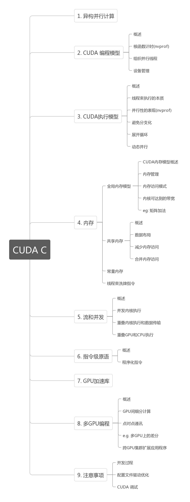
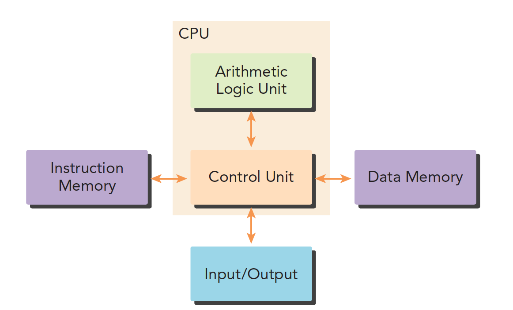
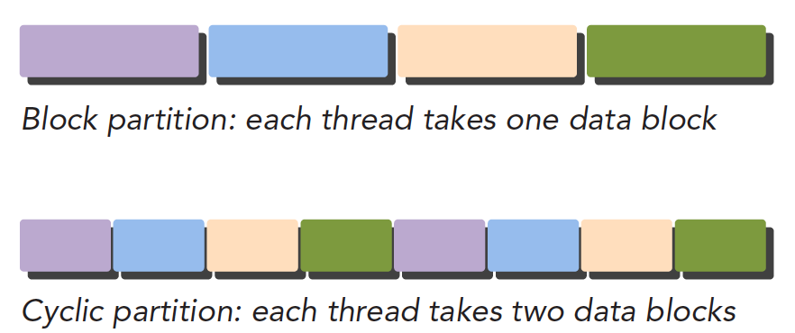
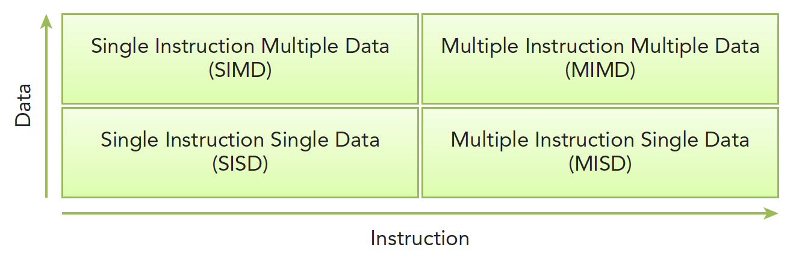
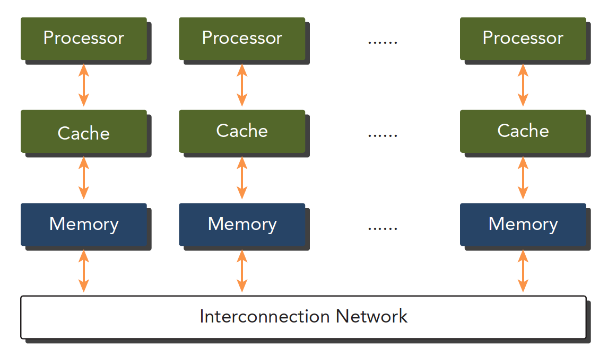
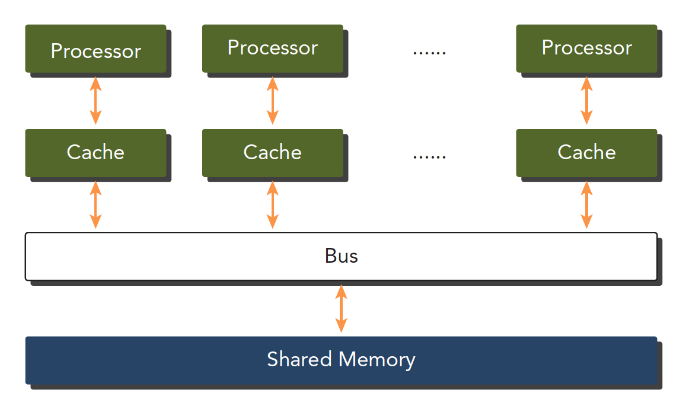

### 并行计算与计算机架构

**Abstract:** 本文从总体上给出了**CUDA**编程的**Big picture**，后续所有的文章都在本文的基础上详细展开。
**Keywords:** 并行计算，串行编程，并行编程，计算机架构，并行性，异构架构，**CUDA**

代码和学习blog来源：https://github.com/Tony-Tan

简单的CUDA运行并不困难，但是要写的精简又高效，确实是个难题。关于CUDA的各种教程以及各种文档非常多，尤其是官方给出的就有几个版本，但是都是英文版，而且读起来总是一知半解，我本科阶段接触过`OpenMPI`和`MPI`等CPU的并行计算库，虽然课时很短加上我学艺不精，但是还是建立起来基本的并行思想，对于CUDA，不仅要理解语言，理解模型，还要掌握一定数量的硬件知识，单纯的将代码写出来，能运行，那不是编程的魅力!

这几期的CUDA学习是我去年未完成的计划，我高估了自己的接受能力，加上疫情反反复复，决定在新年开始就啃下这块硬骨头，**前面部分的学习借鉴了**`[Tony-Tan](https://github.com/Tony-Tan)`的博客和代码，所以博客的内容和风格可能会比较接近（毕竟直接怼的大神的blog），但是会有自己的思考在，这也是我记录自己学习的原因

**分界线**

---

> ### 前期知识准备

1. C/C++ 编程，我们使用的基于C++的CUDA编程，C++的编程模式肯定是要了解的
2. 主要还是基础知识，硬件基础（我觉得随我来说是补充的重点），编程模型，基本性能测试，简单优化

> ### **并行计算**

并行计算主要包括两个方面：

- 计算机架构（硬件）
- 并行计算程序（软件）

一个生产工具，一个用工具产生各种不同的应用

硬件主要是为软件提供更快的计算速度，更好的功耗比，结构上支持更快的并行。

软件就是压榨当前的硬件使用出最高的性能，提供稳定的计算结果。

传统的计算机体系结构一般是冯·诺伊曼结构，分为三部分：

- 内存（指令内存，数据内存）
- 中央处理单元
- 输入，输出接口

推荐：《深入理解计算机系统》

并行程序最大的特点就是需要对硬件有一定的了解

> ### 并行性

并行程序简单理解就是将较大的任务分解成小部分，一般一个程序可以看作是指令和数据的结合，并行可以分为两种：

- 指令并行
- 数据并行

我们的任务更关注于数据并行，一个关键的任务就是分析数据的可并行性。

任务并行主要是类似于管理系统，比如支付系统，每天要并行处理各种请求

我们主要是涉及大规模计算，计算过程单一，不同的数据进行相同的计算

CUDA非常适合数据并行

数据并行程序设计，第一步就是把数据根据线程进行划分，一个是有序，一个是无序

1. 块划分，将一整块数据切成小块，每个小块随机划分给一个线程，每个块的执行顺序随机

| thread 线程 |   1   | 2     | 3     | 4        |    5     |
| :---------: | :---: | ----- | ----- | -------- | :------: |
|  block 块   | 1 2 3 | 4 5 6 | 7 8 9 | 10 11 12 | 13 14 15 |

2. 周期划分，线程按照顺序处理相邻的数据块，每个线程处理多个数据块，比如我们有五个线程，线程1执行块1，线程2执行块2…..线程5执行块5，线程1执行块6

| thread | 1    | 2    | 3    | 4    | 5    | 1    | 2    | 3    | 4    | 5    | 1    | 2    | 3    | 4    | 5    |
| ------ | ---- | ---- | ---- | ---- | ---- | ---- | ---- | ---- | ---- | ---- | ---- | ---- | ---- | ---- | ---- |
| block  | 1    | 2    | 3    | 4    | 5    | 6    | 7    | 8    | 9    | 10   | 11   | 12   | 13   | 14   | 15   |

下面是示意图，注意颜色相同的块使用的同一个线程，从执行顺序上看如下：

<b>不同的数据划分严重影响程序性能，所以针对不同的问题和不同计算机结构，我们要通过和理论和试验共同来决定最终最优的数据划分。</b>

这里的理解是 **Block partition** 是将整体分割称几部分后，每个线程负责一部分，但是在执行的过程中

> ### 计算机架构

> #### Flynn’s Taxonomy

划分不同计算机结构的方法有很多，广泛使用的一种被称为佛林分类法Flynn’s Taxonomy，他根据指令和数据进入CPU的方式分类，分为以下四类：

分别以数据和指令进行分析：

- 单指令单数据SISD（传统串行计算机，386）
- 单指令多数据SIMD（并行架构，比如向量机，所有核心指令唯一，但是数据不同，现在CPU基本都有这类的向量指令）
- 多指令单数据MISD（少见，多个指令围殴一个数据）
- 多指令多数据MIMD（并行架构，多核心，多指令，异步处理多个数据流，从而实现空间上的并行，MIMD多数情况下包含SIMD，就是MIMD有很多计算核，计算核支持SIMD）

> ### 根据内存划分

计算机架构也可以根据内存划分：

1. 分布式内存的多节点系统
2. 共享内存的过处理器系统

第一个更大，通常叫做集群，就是一个机房好多机箱，每个机箱都有内存处理器电源等一些列硬件，通过网络互动，这样组成的就是分布式。

第二个是单个主板有多个处理器，他们共享相同的主板上的内存，内存寻址空间相同，通过PCIe和内存互动。

多个处理器可以分多片处理器，和单片多核（众核many-core），也就是有些主板上挂了好多片处理器，也有的是一个主板上就一个处理器，但是这个处理器里面有几百个核。
GPU就属于众核系统。当然现在CPU也都是多核的了，但是他们还是有很大区别的：

- CPU适合执行复杂的逻辑，比如多分支，其核心比较重（复杂）
- GPU适合执行简单的逻辑，大量的数据计算，其吞吐量更高，但是核心比较轻（结构简单）

> 总结

本文主要介绍了下计算机架构的划分和并行计算的基础简单介绍