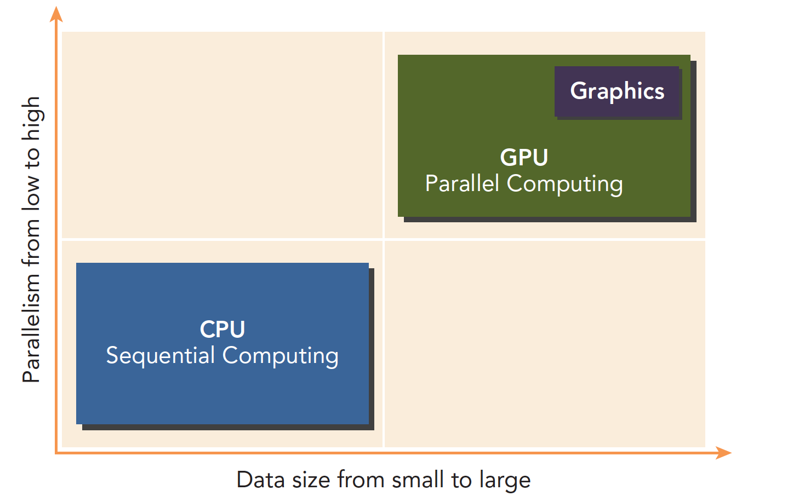
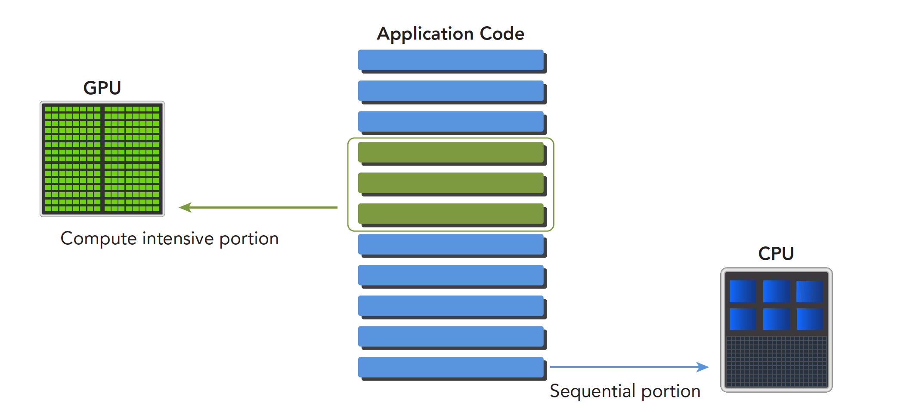

### 异构计算与CUDA

**Abstract:** 介绍异构计算和CUDA概述，完成GPU输出Hello world！
**Keywords:** 异构计算， CUDA

参考：https://github.com/Tony-Tan

> ### 异构计算

异构计算，首先必须了解什么是异构，不同的计算机架构就是异构，上文书我们讲过计算机架构了，就是为了引出异构的概念，按照指令集划分或者按照内存结构划分，但是我觉得只要两片CPU型号不一样就应该叫异构（这个想法先保留，对错不确定）。

异构计算介绍：https://blog.csdn.net/Pieces_thinking/article/details/122264574

这里我理解的是不同的计算单元共同计算去完成整体的计算，例如在并行计算里并不是所有的步骤都直接并行化，有一些步骤是只能串行的，这些操作交给CPU，而经过评估的耗时多的、可并行的部分我们用GPU计算

GPU本来的任务是做图形图像的，也就是把数据处理成图形图像，图像有个特点就是并行度很高，基本上一定距离意外的像素点之间的计算是独立的，所以属于并行任务。

> ### 异构架构

举一个工作站的构成， intel i7-4790 CPU加上两台Titan x GPU构成的工作站，GPU插在主板的PCIe卡口上，运行程序的时候，CPU像是一个控制者，指挥两台Titan完成工作后进行汇总，和下一步工作安排，所以CPU我们可以把它看做一个指挥者，主机端，host，而完成大量计算的GPU是我们的计算设备，device。


上图反应CPU和GPU的大致架构的不同：

- 左图：一个四核CPU一般有四个ALU。ALU是完成逻辑计算的核心，也是我们平时说的四核的核，控制单元，缓存也在片上，DRAM是内存，一般不在片上，CPU通过总线访问内存
- 右图： GPU，绿色小方块是ALU，我们注意红色框内的部分SM，这一组ALU公用一个Control单元和Cache，这个部分相当于一个完整的多核CPU，但是不同的是ALU多了，control部分变小，可见计算能力提升了，控制能力减弱了，所以对于控制（逻辑）复杂的程序，一个GPU的SM是没办法和CPU比较的，但是对了逻辑简单，数据量大的任务，GPU更高效，并且，注意，一个GPU有好多个SM，而且越来越多。

CPU和GPU之间通过PCIe总线连接，用于传递指令和数据，这部分也是后面要讨论的性能瓶颈之一。

一个异构应用包含两种以上架构，所以代码也包括不止一部分：

- 主机代码
- 设备代码

主机代码在主机端运行，被编译成主机架构的机器码，设备端的在设备上执行，被编译成设备架构的机器码，所以主机端的机器码和设备端的机器码是隔离的，自己执行自己的，没办法交换执行。
主机端代码主要是控制设备，完成数据传输等控制类工作，设备端主要的任务就是计算。
因为当没有GPU的时候CPU也能完成这些计算，只是速度会慢很多，所以可以把GPU看成CPU的一个加速设备。

> 范例

CPU和GPU相互配合，各有所长，各有所短，不能说GPU就是比CPU强这种幼稚的话：



低并行逻辑复杂的程序适合用CPU
高并行逻辑简单的大数据计算适合GPU

一个程序可以进行如下分解，串行部分和并行部分：



CPU和GPU线程的区别：

1. CPU线程是重量级实体，操作系统交替执行线程，线程上下文切换花销很大
2. GPU线程是轻量级的，GPU应用一般包含成千上万的线程，多数在排队状态，线程之间切换基本没有开销。
3. CPU的核被设计用来尽可能减少一个或两个线程运行时间的延迟，而GPU核则是大量线程，最大幅度提高吞吐量

> ### CUDA：一种异构计算平台

CUDA平台不是单单指软件或者硬件，而是建立在Nvidia GPU上的一整套平台，并扩展出多语言支持


> ### Hello World!

Hello World是所有程序初学者都非常喜欢的，之前GPU是不能printf的，我当时就很懵，GPU是个做显示的设备，为啥不能输出，后来就可以直接在CUDA核里面打印信息了，我们写下面程序

```c++
/*
*hello_world.cu
*/
#include<stdio.h>
__global__ void hello_world(void)
{
  printf("GPU: Hello world!\n");
}
int main(int argc,char **argv)
{
  printf("CPU: Hello world!\n");
  hello_world<<<1,10>>>();
  cudaDeviceReset();//if no this line ,it can not output hello world from gpu
  return 0;
}
```

完整的项目：`https://github.com/Tony-Tan/CUDA_Freshman`

关键词：`__global__`

是告诉编译器这个是个可以在设备上执行的核函数

关键词：`hello_world<<<1,10>>>();`

这句话C语言中没有’<<<>>>’是对设备进行配置的参数，也是CUDA扩展出来的部分。

关键词：`cudaDeviceReset();`

这句话如果没有，则不能正常的运行，因为这句话包含了隐式同步，GPU和CPU执行程序是异步的，核函数调用后成立刻会到主机线程继续，而不管GPU端核函数是否执行完毕，所以上面的程序就是GPU刚开始执行，CPU已经退出程序了，所以我们要等GPU执行完了，再退出主机线程。

一般CUDA程序分成下面这些步骤：

1. 分配GPU内存
2. 拷贝内存到设备
3. 调用CUDA内核函数来执行计算
4. 把计算完成数据拷贝回主机端
5. 内存销毁

上面的hello world只到第三步，没有内存交换。

NVIDIA为我们提供了：

- Nvidia Nsight集成开发环境
- CUDA-GDB 命令行调试器
- 性能分析可视化工具
- CUDA-MEMCHECK工具
- GPU设备管理工具

