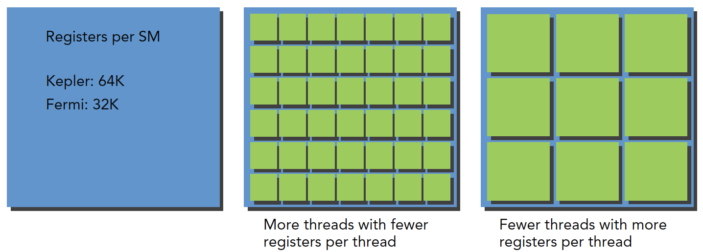
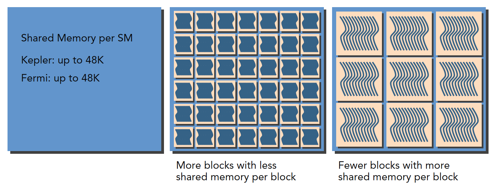
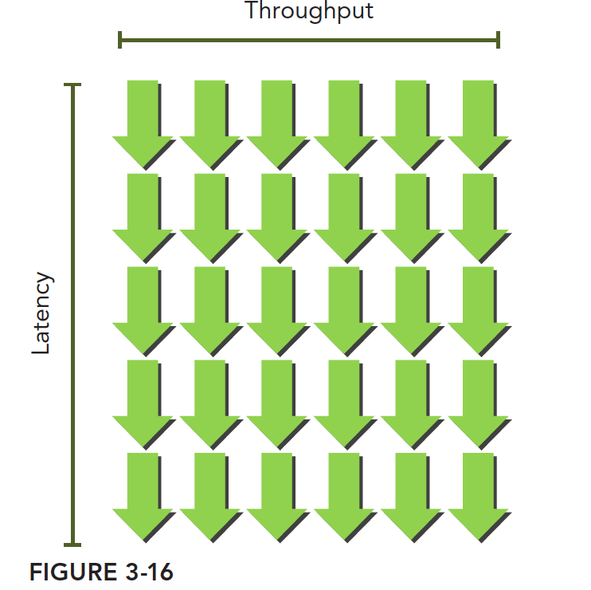

## 理解线程束执行的本质（Part II）

**Abstract:** 本文介绍CUDA线程束执行的本质的后半部分，包括资源，延迟，同步，扩展性等严重影响性能的线

**Keywrds：**吞吐量，带宽，占用率，CUDA同步

欢迎访问Tony的网站：[http://www.face2ai.com](http://www.face2ai.com/)

最近这几篇应该是CUDA最核心的部分，并不是编程模型，而是执行模型，通过执行模型我们去了解GPU硬件的具体运行方式，这样才能保证我们写出更快更好的程序。

### 资源分配

我们前面提到过，每个SM上执行的基本单位是线程束，也就是说，单指令通过指令调度器广播给某线程束的全部线程，这些线程同一时刻执行同一命令，当然也有分支情况，上一篇我们已经介绍了分支，这是执行的那部分，当然后有很多线程束没执行，那么这些没执行的线程束情况又如何呢？我给他们分成了两类，注意是我分的，不一定官方是不是这么讲。我们离开线程束内的角度（线程束内是观察线程行为，离开线程束我们就能观察线程束的行为了），一类是已经激活的，也就是说这类线程束其实已经在SM上准备就绪了，只是没轮到他执行，这时候他的状态叫做阻塞，还有一类可能分配到SM了，但是还没上到片上，这类我称之为未激活线程束。
而每个SM上有多少个线程束处于激活状态，取决于以下资源：

- 程序计数器
- 寄存器
- 共享内存

这是一个平衡问题，就像一个固定大小的坑，能放多少萝卜取决于坑的大小和萝卜的大小，相比于一个大坑，小坑内可能放十个小萝卜，或者两个大萝卜，SM上资源也是，当kernel占用的资源较少，那么更多的线程（这是线程越多线程束也就越多）处于活跃状态，相反则线程越少。
关于寄存器资源的分配：

关于共享内存的分配：

上面讲的主要是线程束，如果从逻辑上来看线程块的话，可用资源的分配也会影响常驻线程块的数量。
特别是当SM内的资源没办法处理一个完整块，那么程序将无法启动，这个是我们应该找找自己的毛病，你得把内核写的多大，或者一个块有多少线程，才能出现这种情况。

当寄存器和共享内存分配给了线程块，这个线程块处于活跃状态，所包含的线程束称为活跃线程束。
活跃的线程束又分为三类：

- 选定的线程束
- 阻塞的线程束
- 符合条件的线程束

当SM要执行某个线程束的时候，执行的这个线程束叫做选定的线程束，准备要执行的叫符合条件的线程束，如果线程束不符合条件还没准备好就是阻塞的线程束。
满足下面的要求，线程束才算是符合条件的：

- 32个CUDA核心可以用于执行
- 执行所需要的资源全部就位

Kepler活跃的线程束数量从开始到结束不得大于64，可以等于。
任何周期选定的线程束小于等于4。
由于计算资源是在线程束之间分配的，且线程束的整个生命周期都在片上，所以线程束的上下文切换是非常快速的。
下面我们介绍如何通过大量的活跃的线程束切换来隐藏延迟

### 延迟隐藏

所以最大化是要最大化硬件，尤其是计算部分的硬件满跑，都不闲着的情况下利用率是最高的，总有人闲着，利用率就会低很多，即最大化功能单元的利用率。利用率与常驻线程束直接相关。
硬件中线程调度器负责调度线程束调度，当每时每刻都有可用的线程束供其调度，这时候可以达到计算资源的完全利用，以此来保证通过其他常驻线程束中发布其他指令的，可以隐藏每个指令的延迟。

与其他类型的编程相比，GPU的延迟隐藏及其重要。对于指令的延迟，通常分为两种：

- 算术指令
- 内存指令

算数指令延迟是一个算术操作从开始，到产生结果之间的时间，这个时间段内只有某些计算单元处于工作状态，而其他逻辑计算单元处于空闲。
内存指令延迟很好理解，当产生内存访问的时候，计算单元要等数据从内存拿到寄存器，这个周期是非常长的。
延迟：

- 算术延迟 10~20 个时钟周期
- 内存延迟 400~800 个时钟周期

下图就是阻塞线程束到可选线程束的过程逻辑图：

其中线程束0在阻塞两短时间后恢复可选模式，但是在这段等待时间中，SM没有闲置。
那么至少需要多少线程，线程束来保证最小化延迟呢？
$little$法则给出了下面的计算公式
$$
所需线程束=延迟×吞吐量
$$
注意带宽和吞吐量的区别，带宽一般指的是理论峰值，最大每个时钟周期能执行多少个指令，吞吐量是指实际操作过程中每分钟处理多少个指令。

这个可以想象成一个瀑布，像这样，绿箭头是线程束，只要线程束足够多，吞吐量是不会降低的：

