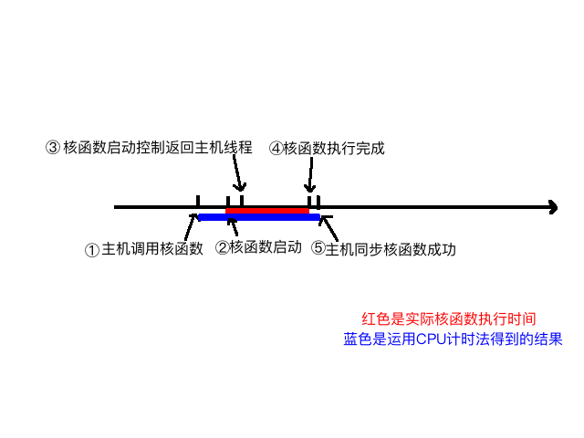

## 给核函数计时

**Abstract:** 本文介绍CUDA核函数计时方法
**Keywords:** gettimeofday,nvprof

编程模型中我们介绍了内存，线程相关的知识，接着我们启动了我们的核函数，这些只是大概的勾勒出CUDA编程的外貌，通过前几篇可以写出一般的可运行程序，但是想获得最高的效率，需要反复的优化，以及对硬件和编程细节的详细了解，怎么评估效率，时间是个很直观的测量方式。

### 用CPU计时

使用cpu计时的方法是测试时间的一个常用办法，实际上我在接触并行计算之前并不怎么关注计时的问题，甚至于对于效率也是够用即可，我们在写C程序的时候最多使用的计时方法是：

```C++
clock_t start, finish;
start = clock();
// 要测试的部分
finish = clock();
duration = (double)(finish - start) / CLOCKS_PER_SEC;
```

其中clock()是个关键的函数，“clock函数测出来的时间为进程运行时间，单位为滴答数(ticks)”；字面上理解CLOCKS_PER_SEC这个宏，就是每秒中多少clocks，在不同的系统中值可能不同。**必须注意的是，并行程序这种计时方式有严重问题！如果想知道具体原因，可以查询clock的源代码（c语言标准函数）**

这里我们使用gettimeofday() 函数

```c++
#include <sys/time.h>
double cpuSecond()
{  
    struct timeval tp; 
    gettimeofday(&tp,NULL);  
    return((double)tp.tv_sec+(double)tp.tv_usec*1e-6);
}
```

gettimeofday是linux下的一个库函数，创建一个cpu计时器，从1970年1月1日0点以来到现在的秒数，需要头文件sys/time.h
那么我们使用这个函数测试核函数运行时间：

```c++
#include <cuda_runtime.h>
#include <stdio.h>
#include "freshman.h"

__global__ void sumArraysGPU(float*a,float*b,float*res,int N)
{
  int i=blockIdx.x*blockDim.x+threadIdx.x;
  if(i < N)
    res[i]=a[i]+b[i];
}
int main(int argc,char **argv)
{
  // set up device.....

  // init data ......

  //timer
  double iStart,iElaps;
  iStart=cpuSecond();
  sumArraysGPU<<<grid,block>>>(a_d,b_d,res_d,nElem);
  cudaDeviceSynchronize();
  iElaps=cpuSecond()-iStart;

  // ......
}
```

主要分析计时这段，首先iStart是cpuSecond返回一个秒数，接着执行核函数，核函数开始执行后马上返回主机线程，所以我们必须要加一个同步函数等待核函数执行完毕，如果不加这个同步函数，那么测试的时间是从调用核函数，到核函数返回给主机线程的时间段，而不是核函数的执行时间，加上了

```c++
cudaDeviceSynchronize();
```

函数后，计时是从调用核函数开始，到核函数执行完并返回给主机的时间段，下面图大致描述了执行过程的不同时间节点：



我们可以大概分析下核函数启动到结束的过程：

1. 主机线程启动核函数
2. 核函数启动成功
3. 控制返回主机线程
4. 核函数执行完成
5. 主机同步函数侦测到核函数执行完

我们要测试的是2~4的时间，但是用CPU计时方法，只能测试1~5的时间，所以测试得到的时间偏长。
接着我们调整下我们的参数，来看看不同线程维度对速度的影响，看看计时能不能反映出来点问题，这里我们考虑一维线程模型

调整 block 的线程数 ，结果就不展示了

CUDA提供了nvprof工具帮助我们进行时间分析，我们说明windows下nvprof的使用

一个很有意思的现象是，nvcc编译在windows下会报错，原始是使用了vs 的头文件，使用vs编译cuda工程没有问题，对于计时这里我们先不深究，先学习整体
